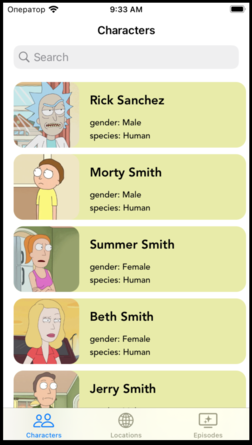

## Краткое описание
- Проект написан на **UIKit**
- Использована архитектура **MVP** ( был **MVC** )
- Использованны различные патерны проектирования
- Splash Screen
- Адаптивная верстка интерфейса **кодом**. Проверна на **iPhoneSE (2st generation)**
- Работа с сетью **Alamofire** ( был **URLSession** )
- Вывод ошибок через Alert
- Добавлен поисковик ( **UISearchController** )
- Поддерживает **IPad**
- Поддерживает горизонтальный режим
## Презентация


## Задание
- Необходимо написать приложение, которое загружает с сервера JSON-файл,
разбирает его и выводит на экран информацию в категориях: 
> Персонажи:
```
 - Имя
 - Пол
 - Вид
 - Картинка персонажа
 ```
> Локации:
```
 - Название локации
 - Тип
 - Измерение
 ```
> Эпизоды:
```
 - Название эпизода
 - Дата выпуска
 - Номер эпизода
```
## Будет добавлено
- Unit testing
- Кеширование данных
- Core Data
