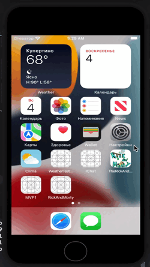

## Краткое описание

-- Работодатель разрешил публикацию данного тестового задания у себя в гитхабе, но запретил оставлять упоминание о компании!

- Проект написан на **UIKit**
- Использована архитектура **MVP** + **MVVM** ( был **MVC** )
- iOS >=13
- Core Data
- UserDefaults
- Использованны различные патерны проектирования
- CocoaPods(R.swift, Swiftlint, FireBase(Analytics))
- Local Notification
- Debug Menu
- DI
- Splash Screen
- Адаптивная верстка интерфейса **кодом**. Проверна на **iPhoneSE (2st generation)**
- Работа с сетью **Alamofire** ( был **URLSession** )
- Добавлена обработка ошибок при работе с NetworkManager, ImageManager. Ошибки отображаются пользователю через UIAlerController.
- Бесконечный скролл картинок ( **UICollectionView** )
- Добавлен поисковик ( **UISearchController** )
- Поддерживает **IPad**
- Поддерживает горизонтальный режим
## Презентация


## Задание
На базе существующего API “The Rick and Morty” необходимо разработать iOS- приложение.
Язык программирования – Swift
## - Используемые инструменты:
API - “The Rick and Morty”
Системы контроля зависимостей: Cocoapods или SPM
## - Среда разработки:
XCode
## - Требования к реализации:
Версия iOS 13+.
Верстка в коде, autolayout (Anchor based, SnapKit и тд).
Работа с сетью через Alamofire.
Можно использовать любые сторонние библиотеки на ваш выбор
## - Будет плюсом если:
1. Поиск будет контекстным (обновление списка при вводе новой буквы). В этом случае отказываемся от кнопки ПОИСК, добавить крестик в полее ввода для его очистки.
2. Приложение корректно будет отрабатывать поворот экрана.
3. Приложение корректно будет рботать на iPad, iPadPro.
4. Код залит в репозиторий, собирается, корректно настроен gitignore
5. Код покрыт тестами
## - Критерий оценки:
1. мобильное приложение устанавливается
2. мобильное приложение запускается
3. мобильное приложение содержит все страницы
4. мобильное приложение отображает контент
5. мобильное приложение не крашится
## - Функционал приложения:
- Приложение должно состоять из нескольких страниц:
> Персонажи:
```
 - Имя
 - Пол
 - Вид
 - Картинка персонажа
 ```
> Локации:
```
 - Название локации
 - Тип
 - Измерение
 ```
> Эпизоды:
```
 - Название эпизода
 - Дата выпуска
 - Номер эпизода
```
## Будет добавлено
- Unit testing
